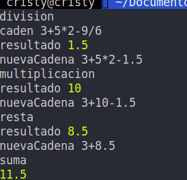

# Pasantia22.2 | Semana 1 | Día 5

## Reto de la semana

1. Se ingresa la cadena.
2. Se verifica el tamaño de la caden
    -Si la cadena contiene mas de 20 caracteres muestra un aviso que la cadena es muy grande.
    -Si la cadena contiene menos de 20 caracters pasa a la siguiente comprobacion.
3. Se verifica que tipo de operadores existen en la cadena, respetando el orden de las operaciones.
    - Se inicia verificando si existe una operacion de divison dentro de la cadena. sino se encuentra se 
    procede a pasar a la multiplicacion, de la misma forma se verifica para pasar a la resta y a la suma
        - Si existe alguna divison, multipliacion o resta se lleva a cabo la operacion correspondiente de la siguiente manera.
            - Se busca la posicion de donde se encuentra el operador que se esta trabajando.
            - Se retrocede la cantidad de espacios hasta encontrar otro operador de cualquier tipo esto para obtener el primer valor numerico
            - se avanza la cantidad de espacios necesarios hasta encontrar otro operador para obtener el segundo dato.
            - se lleva a cabo la operacion.
            - se crea una nueva cadena sustituyendo la operacion por su resultado.
            - se devuelve la cadena al paso 3 para volver a verificar que tipos de operaciones quedan.
            - Esto se repite para ir eliminando las operaciones en orden hasta conseguir dejar solamente sumas, cuando sucede esto se pasa al paso numero 4
4. Si al verificar solamente se encuentran operadores de suma, se convierte la cadena a un array y se suman los valores del array,
    de esta forma se encuentra el resultado total

Al presentar El día viernes el reto no estaba funcionando bien el programa, volvi a corregir y funciona como se solicito probando con las cadenas que se solicitaron el día viernes y probando diferentes cadenas.

- 

- 

- 